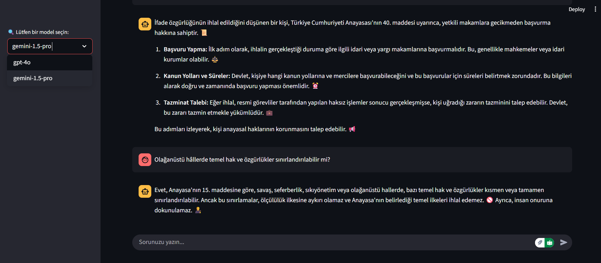

# 🇹🇷 Türkiye Anayasası Sohbet Asistanı

Bu proje, Türkiye Cumhuriyeti Anayasası hakkında sorulan sorulara doğru, öz ve Türkçe yanıtlar vermeyi amaçlayan bir **Retrieval-Augmented Generation (RAG)** tabanlı chatbot sistemidir. Kullanıcılar, GPT-4o veya Gemini-1.5-pro modellerinden birini seçerek sohbet arayüzü üzerinden Türkiye Anayasası'na dair sorular sorabilir.

---

## 🔧 Özellikler

- 📄 Türkiye Anayasası PDF'inden bilgi alma
- 🔍 Vektör tabanlı belge arama (ChromaDB + embedding)
- 💬 GPT-4o ve Gemini-1.5-pro modelleriyle soru-cevap
- 📊 Model performans karşılaştırma (BERTScore ile)
- 🌐 Streamlit arayüzü ile kullanıcı dostu etkileşim
- 🇹🇷 Türkçe doğal dil işleme ve cevaplama

---

🖥️ Çalışan Demo 




---
## 📁 Proje Yapısı

```
hukuk_chatbot/
│
├── app/
│   ├── streamlit.py               # Ana Streamlit arayüzü
│   └── data/gerekceli_anayasa.pdf# Kaynak PDF
│
├── models/
│   ├── gpt_model.py               # GPT-4o tabanlı RAG modeli
│   └── gemini_model.py            # Gemini tabanlı RAG modeli
│
├── evaluation/
│   └── evaluate_models.py         # Modellerin karşılaştırmalı performans analizi
│
├── chroma_db_gpt/                # GPT için vektör veritabanı
├── chroma_db_gemini/             # Gemini için vektör veritabanı
└── requirements.txt              # Bağımlılıklar
```

---

## 🔄 Akış Diyagramı

```
A[Kullanıcı Soru Girer] --> B[Model Seçimi (GPT-4o veya Gemini)]
B --> C[Retriever: Belge Arama (Chroma)]
C --> D[LLM: Cevap Oluşturma]
D --> E[Sohbet Arayüzünde Yanıtı Göster]
```

---

## 🧠 Nasıl Çalışır?

1. `gerekceli_anayasa.pdf` adlı anayasa belgesi yüklenir.
2. Belge küçük parçalara bölünerek embedding (vektör temsili) oluşturulur.
3. Chroma DB içine bu belgeler kaydedilir.
4. Kullanıcı bir soru sorduğunda:
   - Retriever en alakalı belge parçalarını bulur.
   - LLM bu parçaları kullanarak cevap üretir.
5. Kullanıcıya Türkçe ve emoji destekli bir yanıt sunulur.

---

## ⚖️ Model Değerlendirme

`evaluate_models.py` script'i ile:

- Test datasından 50 adet örnek soru üretilir.
- Hem GPT-4o hem Gemini yanıtları alınır.
- Türkçe destekli **BERTScore** kullanılarak cevap kaliteleri karşılaştırılır.
- Aşağıdaki metrikler hesaplanır:
  - Precision
  - Recall
  - F1-score

---

## ⚖️ Model Değerlendirme Çıktısı

`evaluate_models.py` script'i ile:
- GPT-4o BERTScore Sonuçları:
    - F1: 0.5258
    - Precision: 0.4798
    - Recall: 0.5882


- Gemini-1.5-pro BERTScore Sonuçları:
   - F1: 0.4647
   - Precision: 0.4253
   - Recall: 0.5180

---

## 🖥️ Başlatma

### Ortam Kurulumu

```bash
python -m venv venv
source venv/bin/activate  # Windows için: venv\Scripts\activate
pip install -r requirements.txt
```

### Uygulamayı Başlat

```bash
streamlit run app/streamlit.py
```

---

## 🔐 Ortam Değişkenleri (.env)

Projenin çalışabilmesi için API anahtarlarını içeren bir `.env` dosyası oluşturun:

```
OPENAI_API_KEY=your-openai-api-key
GOOGLE_API_KEY=your-google-api-key
```

---

## 📌 Notlar

- **Veri Gizliliği:** Sadece `gerekceli_anayasa.pdf` içeriği kullanılır.
- **Dil Desteği:** Yalnızca Türkçe yanıt verir.
- **Sınırlama:** Başka ülke yasaları hakkında bilgi vermez.
